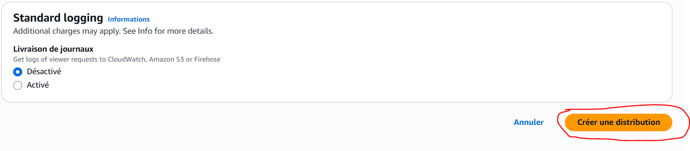

# 🌐 Hébergement sécurisé d’un site web statique avec Amazon S3 et CloudFront

Ce projet a été réalisé dans le cadre de ma préparation à la certification **AWS Certified Solutions Architect – Associate (SAA)**.

## 🎯 Objectif du projet

L'objectif est de mettre en place une architecture cloud sécurisée pour héberger un site web statique en utilisant **Amazon S3** et **CloudFront**. Le site est distribué via HTTPS grâce à une **Origin Access Identity (OAI)**, empêchant tout accès public direct au bucket S3. Cette approche respecte les bonnes pratiques de sécurité cloud et d’optimisation de la distribution de contenu.

## 🧰 Services AWS utilisés

- **Amazon S3** : stockage du contenu statique (index.html).
- **Amazon CloudFront** : distribution de contenu via HTTPS et OAI.
- **IAM** : gestion des permissions et création d’une OAI.
- *(Optionnel)* Route 53 : non utilisé ici, mais utile pour rattacher un domaine personnalisé.

## 🧱 Architecture

Client Web
↓ HTTPS
CloudFront (CDN + OAI)
↓ sécurisé
Amazon S3 (bucket privé contenant index.html)

---

### 🎯 **Nom du Lab** : Hébergement statique sécurisé d’un site web avec Amazon S3 et CloudFront

---

### 📘 **Objectif pédagogique**

* Apprendre à configurer un site web statique dans un bucket Amazon S3.
* Comprendre comment sécuriser l’accès au contenu avec **CloudFront** et une **OAI (Origin Access Identity)**.
* Configurer un **bucket policy** sécurisé.
* (Optionnel) Appréhender la configuration DNS avec **Route 53** dans le cas d’un domaine existant (peut être ignoré si pas de domaine).

---

### 🧰 **Services AWS utilisés (Free Tier)**

* Amazon S3 (stockage statique)
* Amazon CloudFront (1 To en Free Tier)
* AWS IAM (pour les rôles/politiques)
* (Optionnel) Route 53 (si domaine déjà disponible)

---

### 🧱 **Architecture du Lab**

```
Client Web
   |
   v
CloudFront (CDN + HTTPS)
   |
   v
Bucket S3 (site statique + accès privé via OAI)
```

---

### 📝 **Étapes du Lab**

1. **Créer un bucket S3** avec un nom unique :

   * Désactiver l’accès public.
   * Activer l’hébergement statique.
   * Uploader un fichier `index.html`.


2. **Créer une CloudFront Distribution** :

   * Point d'origine : le bucket S3.
   * Restreindre l'accès avec une **OAI (Origin Access Identity)**.
   * Activer la redirection vers HTTPS.
   * Définir le fichier `index.html` comme default root object.
   * Laisse les autres options par défaut et clique sur Create distribution.





3. **Configurer la bucket policy** pour permettre l’accès uniquement via CloudFront (en liant l’OAI).
Voici un exemple de bucket policy à ajouter manuellement :
{
        "Version": "2008-10-17",
        "Id": "PolicyForCloudFrontPrivateContent",
        "Statement": [
            {
                "Sid": "AllowCloudFrontServicePrincipal",
                "Effect": "Allow",
                "Principal": {
                    "Service": "cloudfront.amazonaws.com"
                },
                "Action": "s3:GetObject",
                "Resource": "arn:aws:s3:::monbucket-profil25/*",
                "Condition": {
                    "StringEquals": {
                      "AWS:SourceArn": "arn:aws:cloudfront::ton-id-compte-aws:distribution/ton-id-distribution-cloudfront"
                    }
                }
            }
        ]
}


4. **Tester** : accéder à la distribution CloudFront pour voir le site.


5. 🧹**Nettoyage des ressources (important)** :

   * Supprimer la distribution CloudFront (⚠️ \~15-30 minutes de désactivation).
   * Supprimer le compartiment S3.
   * Supprimer la politique IAM liée à l’OAI.

---

## 📚 Compétences AWS mobilisées

- Hébergement statique sécurisé sur Amazon S3
- Mise en place d’une distribution CloudFront avec OAI
- Création de policies IAM personnalisées
- Activation du HTTPS via redirection automatique
- Application des bonnes pratiques de sécurité cloud

---

## ✅ Résultat

Le site statique a été disponible via le lien CloudFront suivant :  
🔗 [https://du87058bs4wcd.cloudfront.net](https://du87058bs4wcd.cloudfront.net)

Le bucket S3 est totalement privé et n’autorise l’accès qu’à la distribution CloudFront grâce à l’OAI.


> 🧪 Projet réalisé dans la limite du **Free Tier AWS** pour éviter toute facturation inutile.

## 📄 Rapport complet

📄 [Télécharger le rapport PDF complet](docs/rapport-lab.pdf)

## 👤 Auteur

**France Stanislas Bantantoula Koudissa**  
Etudiant en Master Génie Informatique  
🔗 [LinkedIn](https://ci.linkedin.com/in/france-stanislas-bantantoula-koudissa-30245b254)